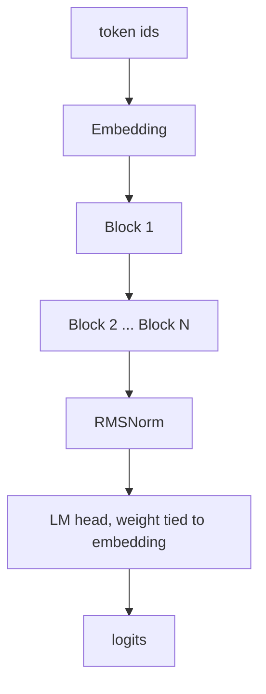
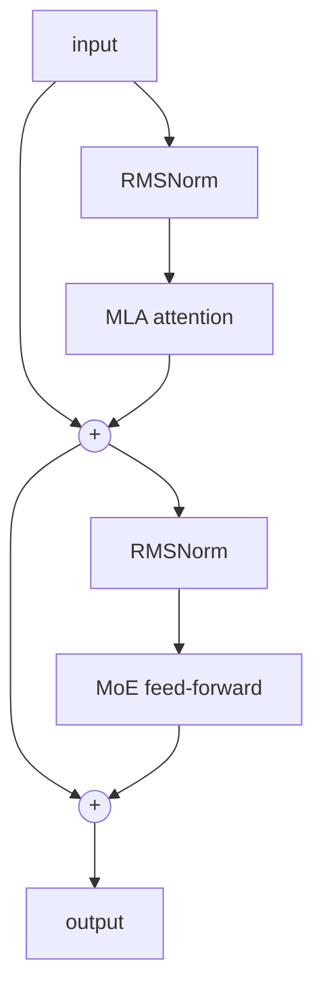
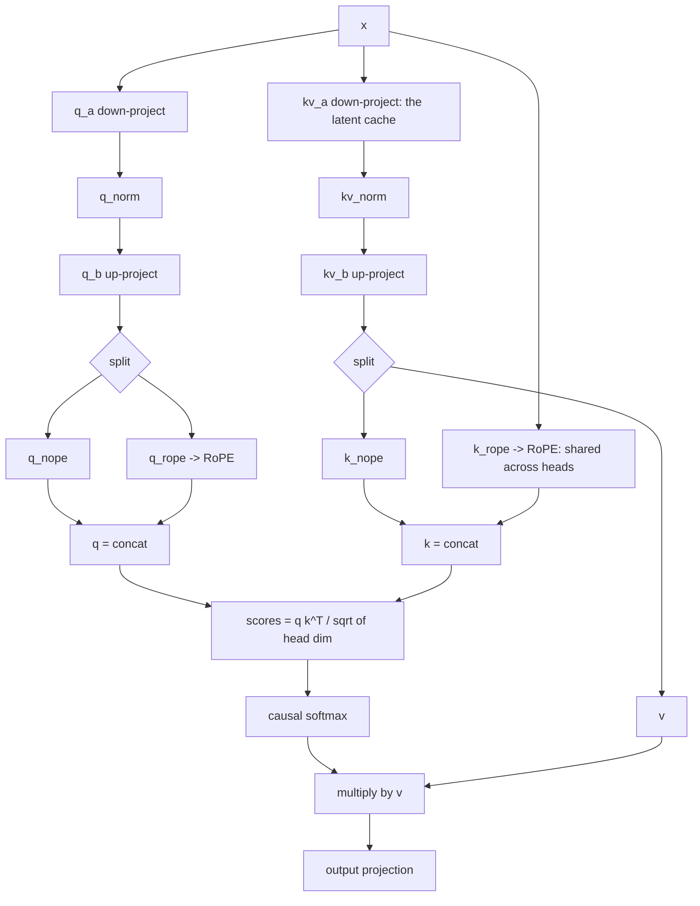
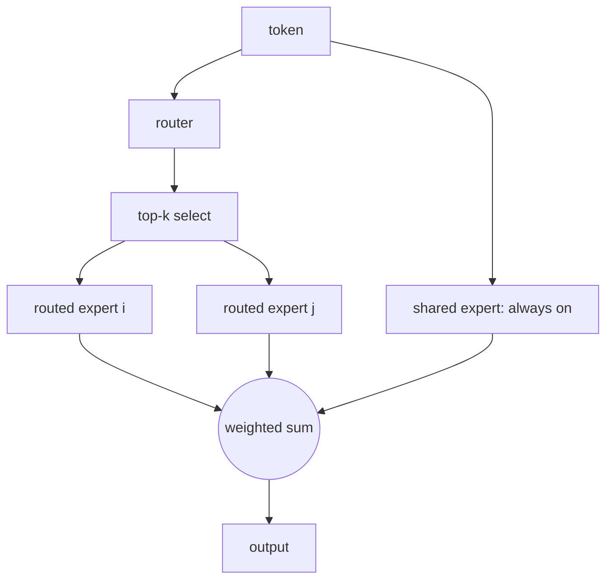

# Architecture

Blueshark is a decoder-only transformer with two ideas that define the 2026 frontier recipe: Multi-head Latent Attention (MLA) for cheap long-context attention, and a fine-grained Mixture-of-Experts feed-forward with an always-on shared expert.

## Full model

## Block

Pre-norm, two residual paths: latent attention, then a sparse MoE feed-forward.

## MLA (Multi-head Latent Attention)

Queries and keys/values are compressed through a small latent before being projected back up. Position information (RoPE) rides on a separate decoupled slice, so the latent that gets cached carries no rotation. This shrinks the KV cache, which is the real memory cost at long context.

## MoE feed-forward

A router scores every token over the routed experts and keeps the top-k. Those fire sparsely. A shared expert runs on every token to hold common knowledge so the routed experts can specialize. A load-balancing auxiliary loss keeps the router from collapsing onto a few experts.

Memory is set by the total number of experts, since they all have to sit in memory. Speed and training cost are set by the active experts, since only the top-k plus the shared one run per token. That split is why a large total model can train and serve like a small one.
