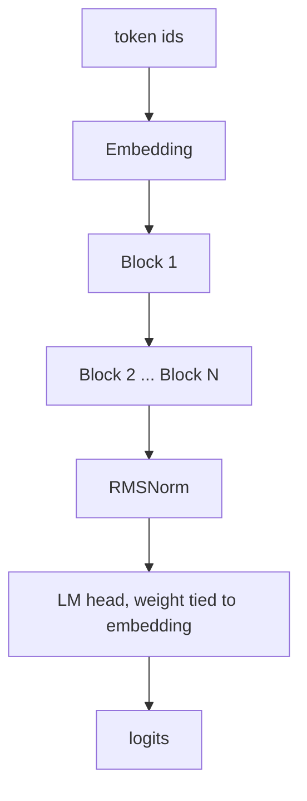
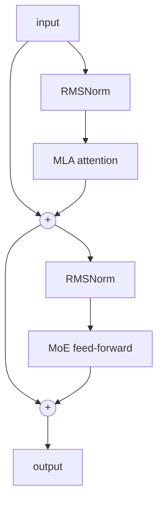

# Blueshark

Reference architecture for a sovereign agentic coding model. Fine-grained Mixture-of-Experts with an always-on shared expert (DeepSeek-style) and Multi-head Latent Attention (MLA). The 2026 frontier recipe, implemented small enough to run and verify on a laptop.

## What this is

`model.py` is the model definition: MLA attention, fine-grained MoE routing, a shared expert, SwiGLU experts, RMSNorm, RoPE, tied embeddings, and a load-balancing auxiliary loss. The default config is tiny so it runs on CPU in seconds. It is the same architecture as the full model, just scaled down.

## Architecture



Each block is pre-norm with two residual paths: latent attention, then a sparse MoE feed-forward.



See [ARCHITECTURE.md](ARCHITECTURE.md) for the MLA and MoE internals.

## Run

```
uv venv --python 3.11
uv pip install torch
.venv/bin/python model.py
```

Expected output: total vs active parameters (the MoE split), correct logit shapes, an initial loss near ln(vocab) which confirms correct initialization, and the loss collapsing when overfitting a single batch which confirms it learns.

## Scope

This is the architecture, proven to run and learn. It is not yet a trained model, a tokenizer, a data pipeline, or a distributed training stack. Those come next.

## Scale

The same code scales to roughly 30B total and 3B active by widening the model, adding depth, and raising the expert count (see the SCALE_TO_30B note in `model.py`). Exact dimensions are tuned on a small proof model first.

## License

MIT
