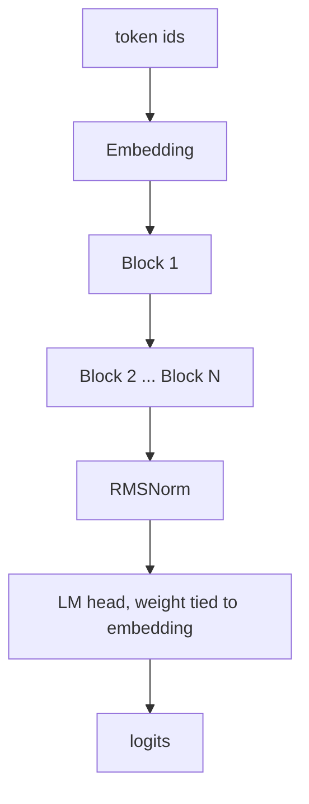
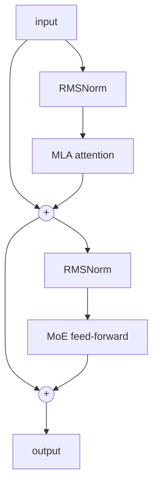

# Blueshark

Reference architecture for a sovereign agentic coding model. Fine-grained Mixture-of-Experts with an always-on shared expert (DeepSeek-style) and Multi-head Latent Attention (MLA). The 2026 frontier recipe, implemented small enough to run and verify on a laptop.

## What this is

`model.py` is the model definition: MLA attention (via FlashAttention / `scaled_dot_product_attention`), fine-grained MoE routing with a shared expert and aux-loss-free load balancing (sigmoid router + per-expert bias, DeepSeek-V3 style), SwiGLU experts, RMSNorm, RoPE, tied embeddings, and reserved agentic special tokens. The default config is tiny so it runs on CPU in seconds. It is the same architecture as the full model, just scaled down.

## Architecture



Each block is pre-norm with two residual paths: latent attention, then a sparse MoE feed-forward.



See [ARCHITECTURE.md](ARCHITECTURE.md) for the MLA and MoE internals.

## Run

```
uv venv --python 3.11
uv pip install torch tokenizers numpy
.venv/bin/python model.py     # sanity check: builds, learns, experts stay balanced
.venv/bin/python corpus.py    # build a small good-quality corpus from the local stdlib
.venv/bin/python train.py     # train our own BPE tokenizer + a sub-1B model on the Mac GPU
.venv/bin/python eval.py      # scaling study: does the architecture improve with size
```

`model.py` prints the MoE split, a starting loss near ln(vocab) (correct init), and the loss collapsing on one batch (it learns). `train.py` trains a byte-level BPE tokenizer we train ourselves and a ~16M model end to end. `eval.py` trains a ladder of sizes and fits a power law to check the architecture scales.

Device is auto-detected and runs across **NVIDIA (CUDA), Apple Silicon (MPS), or plain CPU**. `indeval` needs only the Python standard library (no torch, no GPU) and `indeval/run_eval.py` grades any model behind an OpenAI-compatible endpoint, so it runs anywhere.

## Scope

This is a working reference: the architecture, a tokenizer we train ourselves, a small training loop on the Mac GPU, and an eval system. It is not the full model: there is no distributed-training stack or large-scale data pipeline yet. Those are what scale and compute buy.

## Scale

The same code scales to roughly 30B total and 3B active by widening the model, adding depth, and raising the expert count (see the SCALE_TO_30B note in `model.py`). Exact dimensions are tuned on a small proof model first.

## India-context eval (indeval)

`indeval/` is a small, execution-graded eval that measures whether a coding model gets *Indian* developer tasks actually correct, not just plausible-looking. **16 tasks** across identifiers, money, tax, payments, APIs and delivery, each enforcing a rule a Western benchmark never tests:

| Task | Domain | The India-specific rule |
|------|--------|-------------------------|
| `gstin_validate`  | GST     | 15-char structure **+ Luhn mod-36 check digit** |
| `gst_tax_split`   | GST     | **CGST+SGST (intra-state) vs IGST (inter-state)** by state code |
| `pan_validate`    | PAN     | shape **+ 4th char is the holder-type code** (P/C/H/A/B/G/J/L/F/T) |
| `aadhaar_validate`| Aadhaar | 12 digits, first-digit rule, **+ Verhoeff checksum** |
| `abha_validate`   | Health  | 14-digit ABHA, **Verhoeff check digit** |
| `ifsc_validate`   | IFSC    | 11 chars, **5th character is the reserved `0`** |
| `cin_validate`    | Company | 21-char: **listing status, RoC state, year, company-type code** |
| `vehicle_plate`   | Vehicle | real state code **+ BH (Bharat) series** form |
| `rupay_card_validate` | Payments | **Luhn + RuPay BIN** (rejects valid Visa/Mastercard) |
| `mobile_validate` | Mobile  | normalize `+91`/`0` prefix **+ first digit 6-9** |
| `upi_p2m_link`    | UPI     | NPCI deep-link: `cu=INR`, 2-decimal `am`, P2M `tr`+`mc`, encoding |
| `razorpay_webhook_verify` | API | **HMAC-SHA256** signature over the raw body, constant-time compare |
| `inr_format`      | Money   | **lakh-crore** grouping (`12,34,567`, not `1,234,567`) |
| `inr_to_words`    | Money   | **lakh/crore** words, never million/billion |
| `cart_checkout_total` | Delivery | **per-item GST slabs** (mixed-rate cart), fees untaxed |
| `financial_year`  | Date    | **Apr-Mar financial year** and quarter from a date |

Each task ships a discriminator (an input that is format-valid but rule-invalid), so a model that only learned the shape fails where it counts. The same machinery is dual-use: it is the benchmark, and scaled up with a disjoint task set it becomes the verifiable-reward environment for post-training.

```
python3 -m indeval.run_demo
```

No model or GPU needed: it grades a correct reference (100%, 94/94) against a format-only naive solution (~54%), and confirms all sixteen tasks discriminate. Point `indeval/run_eval.py` at any OpenAI-compatible endpoint to score a real model.

## License

MIT
