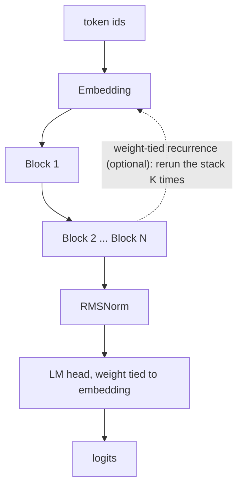
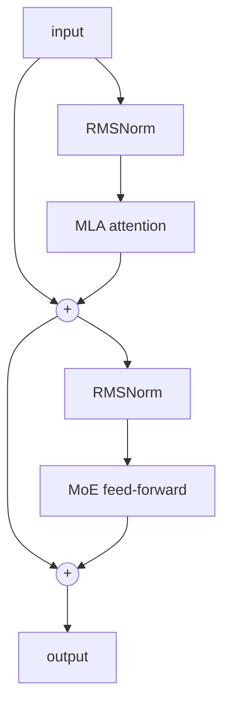

# Blueshark

Reference architecture **and working training stack** for a sovereign agentic
coding model. Fine-grained Mixture-of-Experts with an always-on shared expert
(DeepSeek-style) and Multi-head Latent Attention (MLA) — the 2026 frontier
recipe, implemented small enough to run, **train, visualize, and experiment with
on a laptop or a single rented GPU**.

> **New here / resuming work?** Read [STATUS.md](STATUS.md) first — it's the
> current state, the findings, and the next action in one page.

## What's in the box

| Piece | What it is |
|---|---|
| `model.py` | the architecture: MLA attention (FlashAttention `scaled_dot_product_attention`), fine-grained MoE (shared expert + aux-loss-free sigmoid-router balancing, DeepSeek-V3 style), SwiGLU experts, RMSNorm, RoPE, tied embeddings, reserved agentic tokens, and **optional weight-tied recurrent depth** |
| `configs.py` | model-size presets: `proof`, `finegrained`, `recur3`, `deep8`, `coherent` |
| `pipeline/` | the real training stack: trajectory parser → tokenizer → packed-shard tokenizer → **streamed masked-SFT trainer** (warmup+cosine, eval, checkpoint/resume, `--init` warm-start, structured logging) |
| `viz/` | a zero-dependency **live activation viewer** — watch attention, MoE routing, the residual stream, and generation, with a config switcher |
| `indeval/` | execution-graded India-context eval (16 tasks) — the benchmark and the future RL reward env |
| `colab/` | a ready Colab notebook for the whole train loop |

Docs: [STATUS.md](STATUS.md) · [RUNS.md](RUNS.md) (every run + eval) ·
[EXPERIMENTS.md](EXPERIMENTS.md) (arch bets) · [MODELS.md](MODELS.md) (checkpoint
registry) · [PLAN_COHERENCE.md](PLAN_COHERENCE.md) (the next run) ·
[ARCHITECTURE.md](ARCHITECTURE.md) (MLA/MoE internals)

## Architecture



Each block is pre-norm with two residual paths: latent attention, then a sparse MoE feed-forward.



See [ARCHITECTURE.md](ARCHITECTURE.md) for the MLA and MoE internals.

## Run

```bash
uv venv --python 3.11
uv pip install torch tokenizers numpy pyarrow

# 1. sanity-check the architecture (builds, learns, experts stay balanced)
.venv/bin/python model.py

# 2. the live activation viewer (open http://127.0.0.1:7860)
.venv/bin/python viz/server.py

# 3. the training pipeline (parse agentic traces -> pack -> masked SFT)
.venv/bin/python pipeline/parse_swe_trajectories.py
.venv/bin/python pipeline/tokenize_pack.py --sft data/sft/swe_agentic_sft.jsonl --name swe_sft
.venv/bin/python pipeline/train.py --data swe_sft --config proof --out runs/sft --steps 2000
```

Device is auto-detected across **NVIDIA (CUDA), Apple Silicon (MPS), or CPU**.
The trainer streams from memory-mapped token shards (corpus never needs to fit in
RAM), computes loss only on masked (model-turn) tokens for SFT, and logs to
`metrics.jsonl` (+ TensorBoard if installed). `--init <ckpt>` warm-starts SFT from
a pretrained base; `--resume` survives a dropped session.

## Results so far

Built end to end and validated on free/cheap compute (full log in [RUNS.md](RUNS.md)):

- **pretrain → SFT works** — code-pretrain then masked SFT cut val loss **3.17 → 2.31**.
- **Recurrent depth wins** — `recurrence=K` reruns the block stack K times for K×
  effective depth at **zero extra params**. recur3 (12 effective layers) hit
  **val 2.84 vs 3.58** for the 4-layer baseline at identical params.
- **Data-bound, not arch-bound** — more steps on too little data overfits; quality
  comes from data + training.
- **Narrow domain → coherence** — broad multilingual code made a tiny model produce
  mush; the path to a coherent small model is a *narrow* (Python-only) corpus
  (TinyStories logic). That's the next run.

The live viewer makes all of this visible: per-layer attention maps, which experts
each token routes to, the residual stream growing through depth, and autoregressive
generation (with a repetition penalty).

## Scope & scale

This is a working reference: architecture, a tokenizer we train ourselves, a
streamed training pipeline, a visualizer, and an eval system. It is **not** the
full model — there is no distributed-training stack yet. The same code scales to
roughly **30B total / 3B active** by widening, deepening, and raising the expert
count (see `SCALE_TO_30B` in `model.py`); dimensions are tuned on the small proof
model first. The immediate target is a small but genuinely coherent Python model —
[PLAN_COHERENCE.md](PLAN_COHERENCE.md).

## India-context eval (indeval)

`indeval/` is a small, execution-graded eval that measures whether a coding model gets *Indian* developer tasks actually correct, not just plausible-looking. **16 tasks** across identifiers, money, tax, payments, APIs and delivery, each enforcing a rule a Western benchmark never tests:

| Task | Domain | The India-specific rule |
|------|--------|-------------------------|
| `gstin_validate`  | GST     | 15-char structure **+ Luhn mod-36 check digit** |
| `gst_tax_split`   | GST     | **CGST+SGST (intra-state) vs IGST (inter-state)** by state code |
| `pan_validate`    | PAN     | shape **+ 4th char is the holder-type code** (P/C/H/A/B/G/J/L/F/T) |
| `aadhaar_validate`| Aadhaar | 12 digits, first-digit rule, **+ Verhoeff checksum** |
| `abha_validate`   | Health  | 14-digit ABHA, **Verhoeff check digit** |
| `ifsc_validate`   | IFSC    | 11 chars, **5th character is the reserved `0`** |
| `cin_validate`    | Company | 21-char: **listing status, RoC state, year, company-type code** |
| `vehicle_plate`   | Vehicle | real state code **+ BH (Bharat) series** form |
| `rupay_card_validate` | Payments | **Luhn + RuPay BIN** (rejects valid Visa/Mastercard) |
| `mobile_validate` | Mobile  | normalize `+91`/`0` prefix **+ first digit 6-9** |
| `upi_p2m_link`    | UPI     | NPCI deep-link: `cu=INR`, 2-decimal `am`, P2M `tr`+`mc`, encoding |
| `razorpay_webhook_verify` | API | **HMAC-SHA256** signature over the raw body, constant-time compare |
| `inr_format`      | Money   | **lakh-crore** grouping (`12,34,567`, not `1,234,567`) |
| `inr_to_words`    | Money   | **lakh/crore** words, never million/billion |
| `cart_checkout_total` | Delivery | **per-item GST slabs** (mixed-rate cart), fees untaxed |
| `financial_year`  | Date    | **Apr-Mar financial year** and quarter from a date |

Each task ships a discriminator (an input that is format-valid but rule-invalid), so a model that only learned the shape fails where it counts. The same machinery is dual-use: it is the benchmark, and scaled up with a disjoint task set it becomes the verifiable-reward environment for post-training.

```
python3 -m indeval.run_demo
```

No model or GPU needed: it grades a correct reference (100%, 94/94) against a format-only naive solution (~54%), and confirms all sixteen tasks discriminate. Point `indeval/run_eval.py` at any OpenAI-compatible endpoint to score a real model.

Submitted code runs **sandboxed** (stdlib only, POSIX): an isolated temp working directory, a stripped environment and isolated interpreter, OS resource limits (CPU, memory, file size, no core dumps, process cap), an injected network kill, and process-group termination on timeout. It is hardened, not a hard boundary; for grading fully adversarial models in the open, wrap it in a container or nsjail as an outer layer (the hooks are there).

## License

MIT
